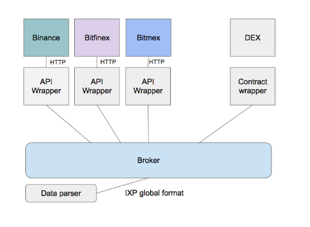

# Archon

Archon is a trading framework for Internet/Crypto exchanges. It makes it simple to trade on multiple exchanges through the API's. This allows the users to define any trading system or application they want across all available exchanges.

The framework allows the user to

* engage in all typical exchange functions such as: submitting orders, tracking balances and market prices
* use any product of any exchange at the same time giving a larger set of assets and instruments to trade, as well as more liquidity at lower risk
* tracking assets, Profit-and-loss statements, strategy analysis
* hedging and portfolio construction
* custom user-interface for trading
* writing algorithms i.e. bots

Ecosystem which can be built on top

* Multi-Exchange trading interface
* Trading bots: arbitrage, market-making, directional trading
* Streaming service
* and more

## Architecture



## examples

get global balances ([source](examples/balance_simple.py))

```
a = broker.Broker()
a.set_active_exchanges([exc.BINANCE])
bl = a.global_balances()
print (bl)
```
 
orderbooks ([source](examples/show_ordersbooks.py))
 
```
book = a.afacade.get_orderbook(market,exchange)
name = exc.NAMES[exchange]
display_book(book, name)
```

[balance_all.py](examples/balance_all.py) - send balance report via mail 

[order.py](examples/order.py) - submit order example

[cancel.py](examples/cancel.py) - cancel open order by command line

[user_tx.py](examples/user_tx.py) - user transactions

## simply strategy

[strategy.py](examples/strategy.py) - basic strategy example

## install 

see [install doc](docs/install.md)

API keys - recommended is to limit the keys to disallow withdraws

## Telegram group

https://t.me/joinchat/Dzif7RALfRB98BocX72Z3Q
